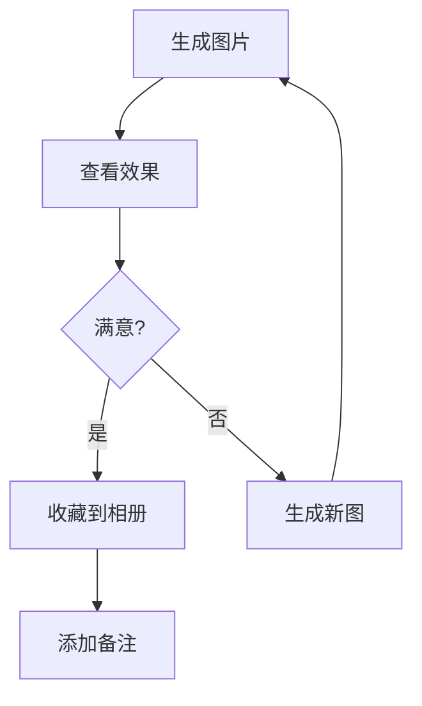

# 韩梅梅技能 - 最佳实践

## 快速开始

### 1. 生成图片
```bash
cd .trae/skills/hanmeimei-avatar/scripts
py selfie-v5.py
```

### 2. 收藏照片
```bash
py selfie-v5.py --save-to-album --album-notes "公园长椅，自然笑容"
```

### 3. 查看统计
```bash
py scheduler.py --stats
```

---

## 标准工作流程

### 日常使用流程



#### 步骤1：生成图片
```bash
py scripts/selfie-v5.py
```

#### 步骤2：查看效果
- 图片保存到：`~/.avatar/outputs/HMM-{timestamp}-{seed}.png`
- 控制台输出包含：时间、地点、种子、场景描述

#### 步骤3：收藏满意照片
```bash
py scripts/selfie-v5.py --save-to-album \
  --album-file "HMM-20260523213812-893539855.png" \
  --album-notes "公园长椅，自然笑容，春日氛围"
```

#### 步骤4：添加备注（可选）
编辑相册备注：
```bash
code .avatar/album.md
```

---

## 定时维护流程

### 每日任务（可选）

使用 Windows 任务计划程序：

```powershell
# 导入任务定义
$action = New-ScheduledTaskAction `
  -Execute "py" `
  -Argument "d:\TRAE\workspace-skills\.trae\skills\hanmeimei-avatar\scripts\scheduler.py --all" `
  -WorkingDirectory "d:\TRAE\workspace-skills"

$trigger = New-ScheduledTaskTrigger -Daily -At 2am

Register-ScheduledTask `
  -TaskName "Hanmeimei-Maintenance" `
  -Action $action `
  -Trigger $trigger `
  -User $env:USERNAME
```

### 手动执行

```bash
# 执行所有维护任务
py scheduler.py --all

# 或单独执行特定任务
py scheduler.py --generate       # 定时出图
py scheduler.py --cleanup        # 清理过期图片
py scheduler.py --stats          # 生成统计报告
py scheduler.py --cleanup-comfyui  # 清理服务器缓存（需扩展）
```

---

## 服务器缓存管理（可选）

### 方案1：自动删除（推荐）

**安装 ComfyUI-api-tools 扩展**

在 ComfyUI 服务器上执行：
```bash
cd ComfyUI/custom_nodes
git clone https://github.com/brantje/ComfyUI-api-tools
# 重启 ComfyUI 服务器
```

**配置启用**
```json
{
  "comfyui": {
    "auto_delete": true
  }
}
```

**效果**：下载图片后自动删除服务器缓存，无需人工干预。

### 方案2：PowerShell 定时任务

在服务器上创建定时清理脚本：

```powershell
# cleanup-comfyui.ps1
$outputDir = "C:\ComfyUI\output"
$retentionDays = 7

Get-ChildItem $outputDir -Filter "HMM-*.png" |
  Where-Object { $_.LastWriteTime -lt (Get-Date).AddDays(-$retentionDays) } |
  Remove-Item -Force
```

注册定时任务（服务器端）：
```powershell
$action = New-ScheduledTaskAction `
  -Execute "powershell.exe" `
  -Argument "-File C:\cleanup-comfyui.ps1"

$trigger = New-ScheduledTaskTrigger -Daily -At 3am

Register-ScheduledTask `
  -TaskName "Cleanup-ComfyUI" `
  -Action $action `
  -Trigger $trigger
```

### 方案3：手动清理

```bash
py scheduler.py --cleanup-comfyui
```

---

## 配置优化

### config.json 推荐配置

```json
{
  "comfyui": {
    "host": "http://10.28.9.6:8188",
    "client_id": "hanmeimei-avatar",
    "timeout": 600,
    "auto_delete": true
  },
  "output": {
    "dir": "~/.avatar/outputs",
    "filename_prefix": "HMM",
    "version": "v5",
    "retention_days": 30
  },
  "defaults": {
    "faceid_weight": 0.80,
    "faceid_weight_0": 1.0,
    "cfg": 4.0,
    "seed": null,
    "scene": null,
    "smile_level": null
  }
}
```

### 配置项说明

| 配置项 | 说明 | 推荐值 |
|--------|------|--------|
| `comfyui.auto_delete` | 下载后自动删除服务器缓存 | `true`（需安装扩展） |
| `output.retention_days` | outputs 文件夹保留天数 | `30` |
| `defaults.faceid_weight` | 脸部相似度权重 | `0.80` |
| `defaults.cfg` | 提示词强度 | `4.0` |

---

## 常见问题

### Q1：为什么服务器缓存没有被删除？

**原因**：未安装 ComfyUI-api-tools 扩展

**解决**：
```bash
cd ComfyUI/custom_nodes
git clone https://github.com/brantje/ComfyUI-api-tools
# 重启 ComfyUI 服务器
```

**影响**：不影响图片生成和本地保存，只是服务器磁盘占用会增长。

---

### Q2：如何清理过期图片？

**自动清理**：
```bash
py scheduler.py --cleanup
```

**手动清理**：
```bash
# 删除 30 天前的图片
cd .avatar/outputs
Get-ChildItem *.png | Where-Object { $_.LastWriteTime -lt (Get-Date).AddDays(-30) } | Remove-Item
```

---

### Q3：如何备份精选照片？

精选照片位于 `~/.avatar/album/`，建议定期备份：

```powershell
Copy-Item -Path ".avatar\album" -Destination "D:\Backup\Hanmeimei-Album-$(Get-Date -Format 'yyyyMMdd')" -Recurse
```

---

### Q4：如何重置工作区？

保留配置和相册，仅清空 outputs：
```bash
Remove-Item .avatar/outputs/*.png -Force
```

完全重置（⚠️ 警告：会删除所有内容）：
```bash
Remove-Item .avatar -Recurse -Force
```

---

## 监控和维护

### 查看磁盘占用
```bash
py scheduler.py --stats
```

### 查看最近生成的图片
```bash
cd .avatar/outputs
Get-ChildItem *.png | Sort-Object LastWriteTime -Descending | Select-Object -First 5 | Format-Table Name, Length, LastWriteTime
```

### 查看精选照片
```bash
cd .avatar/album
Get-ChildItem *.png | Sort-Object LastWriteTime -Descending | Format-Table Name, Length, LastWriteTime
```

---

## 最佳实践总结

| 任务 | 频率 | 命令 |
|------|------|------|
| 生成图片 | 按需 | `py scripts/selfie-v5.py` |
| 收藏照片 | 按需 | `py scripts/selfie-v5.py --save-to-album` |
| 查看统计 | 每周 | `py scheduler.py --stats` |
| 清理过期图片 | 每月 | `py scheduler.py --cleanup` |
| 清理服务器缓存 | 每周（如果未安装扩展） | `py scheduler.py --cleanup-comfyui` |
| 备份精选照片 | 每月 | 手动复制 `.avatar/album` |

---

## 版本历史

- **v5.1.0** (2026-05-23)：SIPOC 优化，统一配置管理
- **v5.0.0**：初始版本

---

## 参考文档

- [SIPOC 优化文档](./SIPOC_OPTIMIZATION.md)
- [工作流配置](./WORKFLOW_GUIDE.md)
- [故障排查指南](./TROUBLESHOOTING.md)