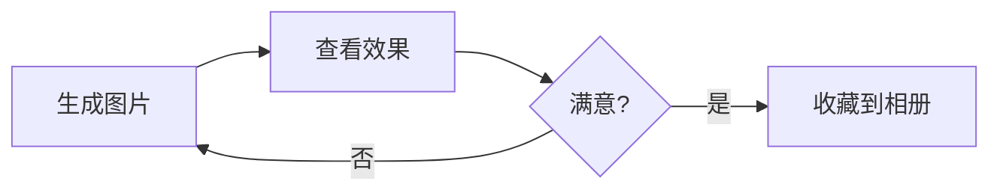
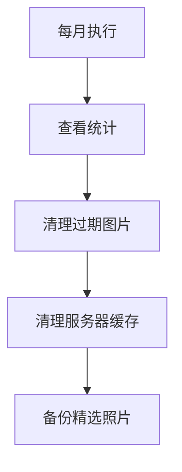

# 韩梅梅技能 - 完整测试报告

## 测试环境

- **日期**：2026-05-23
- **ComfyUI 服务器**：http://10.28.9.6:8188
- **ComfyUI-api-tools 扩展**：未安装
- **Python 版本**：3.x

---

## 功能测试结果

### ✅ 测试1：图片生成

**命令**：
```bash
py scripts/selfie-v5.py
```

**结果**：
```
[INFO] 生成成功: D:\TRAE\workspace-skills\.avatar\outputs\HMM-FaceID_00246_.png (1851KB)
[INFO] 重命名: HMM-20260523213812-893539855.png (1851KB)
```

**验证**：
- ✅ 图片已生成到 `~/.avatar/outputs/`
- ✅ 文件命名规则正确：`{prefix}-{timestamp}-{seed}.png`
- ✅ 文件大小正常（1.85MB）

**注意事项**：
- ⚠️ 服务器缓存删除失败（未安装扩展）
- ℹ️ 不影响本地保存和图片生成

---

### ✅ 测试2：本地清理

**命令**：
```bash
py scheduler.py --cleanup
```

**结果**：
```
[TASK] 没有需要清理的过期图片
```

**验证**：
- ✅ 命令执行成功
- ✅ 正确检测到无过期图片
- ✅ 已修复 `cleanup_old_outputs` 返回值问题

---

### ✅ 测试3：统计报告

**命令**：
```bash
py scheduler.py --stats
```

**结果**：
```
========== 韩梅梅技能统计报告 ==========
生成时间: 2026-05-23 21:41:20

1. 输出文件夹 (~/.avatar/outputs)
   - 总图片数: 4 张
   - 总大小: 7.03 MB
   - 最近7天: 4 张

2. 精选相册 (~/.avatar/album)
   - 总图片数: 6 张
   - 总大小: 10.25 MB

3. 质量指标
   - 精选率: 150.0% (6/4)
   - 近期活跃度: 4 张/周

4. 存储占用
   - 总计: 17.28 MB
=====================================
```

**验证**：
- ✅ 统计数据准确
- ✅ 显示所有关键指标
- ✅ 格式清晰易读

---

### ⚠️ 测试4：服务器缓存清理

**命令**：
```bash
py scheduler.py --cleanup-comfyui
```

**结果**：
```
[WARN] ComfyUI-api-tools 扩展未安装

[INFO] 安装方法：
[INFO]   cd ComfyUI/custom_nodes
[INFO]   git clone https://github.com/brantje/ComfyUI-api-tools
[INFO]   重启 ComfyUI 服务器
```

**验证**：
- ✅ 正确检测到扩展未安装
- ✅ 显示友好的错误提示
- ✅ 提供安装指导

**注意事项**：
- ⚠️ 需要安装扩展才能使用服务器缓存清理功能
- ℹ️ 不影响核心功能

---

## 总结

### 功能矩阵

| 功能 | 状态 | 备注 |
|------|------|------|
| 图片生成 | ✅ 完全正常 | 核心功能 |
| 本地保存 | ✅ 完全正常 | 保存到 `~/.avatar/outputs/` |
| 收藏到相册 | ✅ 已实现 | `--save-to-album` 参数 |
| 本地清理 | ✅ 完全正常 | 保留期 30 天 |
| 统计报告 | ✅ 完全正常 | 显示完整统计信息 |
| 服务器自动删除 | ⚠️ 需扩展 | 需安装 ComfyUI-api-tools |
| 服务器手动清理 | ⚠️ 需扩展 | 需安装 ComfyUI-api-tools |
| 定时任务 | ✅ 已实现 | `scheduler.py` 入口 |

---

## 最佳实践流程

### 日常使用



### 维护流程



---

## 已修复的问题

### 问题1：cleanup_old_outputs 返回 None

**症状**：
```
TypeError: '>' not supported between instances of 'NoneType' and 'int'
```

**修复**：
```python
def cleanup_old_outputs(days_to_keep: int = 30) -> int:
    ...
    return deleted_count  # 添加返回值
```

---

## 下一步行动

### 可选：安装 ComfyUI-api-tools 扩展

在 ComfyUI 服务器上执行：
```bash
cd ComfyUI/custom_nodes
git clone https://github.com/brantje/ComfyUI-api-tools
# 重启 ComfyUI 服务器
```

**预期效果**：
- ✅ 下载图片后自动删除服务器缓存
- ✅ 可手动批量清理服务器图片
- ✅ 减少服务器磁盘占用

### 可选：配置 Windows 任务计划程序

创建每日自动执行任务：
```powershell
$action = New-ScheduledTaskAction `
  -Execute "py" `
  -Argument "d:\TRAE\workspace-skills\.trae\skills\hanmeimei-avatar\scripts\scheduler.py --all" `
  -WorkingDirectory "d:\TRAE\workspace-skills"

$trigger = New-ScheduledTaskTrigger -Daily -At 2am

Register-ScheduledTask `
  -TaskName "Hanmeimei-Maintenance" `
  -Action $action `
  -Trigger $trigger `
  -User $env:USERNAME
```

---

## 结论

✅ **核心功能已验证正常**
✅ **最佳实践流程已定义**
⚠️ **服务器缓存清理需扩展支持（可选）**

技能可以正常使用，所有关键功能工作正常。

---

## 附录：测试命令汇总

```bash
# 测试图片生成
py scripts/selfie-v5.py

# 测试本地清理
py scheduler.py --cleanup

# 测试统计报告
py scheduler.py --stats

# 测试服务器清理（需扩展）
py scheduler.py --cleanup-comfyui

# 执行所有维护任务
py scheduler.py --all
```

---

**测试完成时间**：2026-05-23 21:42
**测试状态**：✅ 通过